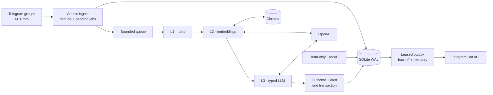

# Eidolon Telegram Scraper

<div align="center">
  
  <br><br>
  <strong>A read-only MTProto intelligence pipeline with measurable AI decisions and durable delivery.</strong>
  <br><br>
  <a href="https://github.com/nikitacometa/eidolon-telegram-scraper/actions/workflows/ci.yml"></a>
  
  
  <a href="LICENSE"></a>
</div>

> **εἴδωλον** — a phantom double. Eidolon watches the noisy chats you cannot,
> preserves the evidence behind each decision, and surfaces only actionable messages.

## Why this project exists

Telegram communities contain valuable, time-sensitive information, but keyword alerts
alone are noisy and sending every message to an LLM is expensive. Eidolon uses a
watcher-specific cascade:

1. deterministic rules remove obvious misses at zero provider cost;
2. contrastive embeddings protect recall while reducing LLM traffic;
3. a structured LLM checks relevance **and allowed intent**;
4. accepted alerts enter a leased SQLite outbox for retryable delivery.

This is deliberately a composable workflow, not an agent-framework wrapper. The
interesting engineering is explicit: trust boundaries, crash recovery, evaluation,
provenance, cost gates, and failure policy.

## Architecture



| Stage | Contract | Failure behavior |
| --- | --- | --- |
| Rules | word-boundary positive/negative terms, minimum length | deterministic rejection |
| Embeddings | versioned positive/negative examples, score, threshold, margin | explicit `degraded`, safe default rejects |
| LLM | strict Pydantic output: relevance, intent, confidence, reason, verbatim evidence | explicit `degraded`, safe default rejects |
| Evaluation | precision/recall gates plus provider-health checks | fail-closed on any degraded prediction |

See [the architecture notes](docs/architecture.md) for transaction boundaries,
delivery semantics, and scale limits.

## Measured quality

The repository includes versioned EN/RU corpora, a threshold-calibration command, config
and dataset hashes, pipeline stopping points, stage scores/errors, aggregate latency and
token accounting, and committed artifacts.

| Run | Cases | Precision | Recall | F1 | Result |
| --- | ---: | ---: | ---: | ---: | --- |
| Offline L1 validation | 20 | 0.889 | 1.000 | 0.941 | pass |
| Online L2 calibration | 24 | 0.833 | 1.000 | 0.909 | pass |
| Online L3 validation | 20 | 1.000 | 1.000 | 1.000 | pass |
| **Initial blind L3 holdout** | **40** | **1.000** | **0.800** | **0.889** | fail: 1 degraded response |
| Post-review frozen-set regression | 40 | 1.000 | 0.750 | 0.857 | fail: degraded response rejected |

The blind result is intentionally not polished away: it found four false negatives and
one non-verbatim evidence response. A security review then changed the default degradation
policy from availability-first acceptance to rejection. Replaying the already-seen frozen
set is reported as a regression—not a second blind run—and turns that case into a fifth
false negative. Read the [methodology and exact commands](docs/evaluation.md).

## Quick start

Requirements: Python 3.12, [uv](https://docs.astral.sh/uv/), a dedicated Telegram
account, Telegram API credentials, and an OpenAI key.

```bash
git clone https://github.com/nikitacometa/eidolon-telegram-scraper.git
cd eidolon-telegram-scraper

uv sync --locked --dev
cp .env.example .env
cp config/watchers.example.yml config/watchers.yml

# Fill TELEGRAM_API_ID, TELEGRAM_API_HASH, TELEGRAM_PHONE, OPENAI_API_KEY,
# one bot token, and PANTHEON_CHAT_ID. Then save a StringSession (mode 0600).
uv run eidolon-auth

# Inspect chat IDs, configure watchers, and start exactly one MTProto worker.
uv run eidolon-chats
uv run eidolon-scraper
```

Never reuse a primary personal account and never run two workers with the same session.
The current product scope monitors and alerts; it does not post, join groups, or reply.

## Watcher policy

`config/watchers.yml` is local and ignored because chat IDs and objectives may be
sensitive. The committed example is synthetic:

```yaml
watchers:
  - name: phangan-housing
    chats: [-1001234567890]
    rules:
      keywords: [house, villa, rent, apartment, сдаю, аренда]
      keywords_negative: [looking for, need, ищу]
      min_length: 20
    examples:
      positive: ["Furnished home available on a monthly lease"]
      negative: ["Scooter rental with daily delivery"]
    target_intents: [offer]
    degraded_policy: reject
    embedding_threshold: 0.42
    llm_level: 3
    alert: immediate
```

Changing embedding references, embedding model, threshold, or margin rebuilds the
fingerprinted Chroma collection. Any validated watcher-policy change also invalidates
pending-job recovery; LLM model or prompt changes do not rebuild Chroma.
`degraded_policy: reject` is the safe default; choose `accept` only when missing a
time-critical alert is demonstrably worse than a rules-only false positive.

## Control plane and containers

The FastAPI process is intentionally read-only and owns no Telegram or model clients:

```bash
uv run uvicorn api:app --host 127.0.0.1 --port 8000

curl http://127.0.0.1:8000/health/ready
curl http://127.0.0.1:8000/stats
curl -X POST http://127.0.0.1:8000/v1/analyze \
  -H 'content-type: application/json' \
  -d '{"watcher_name":"phangan-housing","text":"Villa available monthly"}'
```

`compose.yml` runs one worker and one loopback-only control plane using a non-root,
read-only container:

```bash
docker compose -f compose.yml config --quiet
docker compose -f compose.yml up --build
```

## Reliability and security

- Message insertion, watcher-job creation, chat metadata, terminal outcome, and alert
  enqueue use explicit transaction boundaries. Transient SQLite ingress errors retry;
  an unpersisted update stops the daemon instead of creating a silent monitoring gap.
- Cancellation leaves unfinished work pending; startup replays it from stored message
  data only when its watcher-policy hash still matches. Unexpected poison jobs become
  visible terminal failures; retention never deletes pending pipeline or delivery work.
- Outbox claims use expiring leases, per-claim fencing tokens, bounded attempts,
  sanitized error codes, and exponential backoff. Rows are leased immediately before use.
- Delivery is **at least once**, not exactly once: Telegram offers no idempotency key,
  so a crash after remote acceptance can still duplicate an alert.
- Untrusted messages are JSON user content; watcher policy stays in the system prompt.
  Structured digests validate every source ID before rendering. HTML alerts escape
  Telegram content, raw update storage is off, and retention defaults to 30 days.
- The unauthenticated control plane must remain on loopback or behind authenticated TLS.

Read [SECURITY.md](SECURITY.md) before using real accounts or chat data.

## Engineering commands

```bash
uv run ruff format --check .
uv run ruff check .
uv run mypy
uv run pytest --cov
uv run bandit -r . -c pyproject.toml
uv run pip-audit --local --skip-editable
docker build -t eidolon-telegram-scraper:local .
```

CI runs the same locked quality, coverage, security, dependency, shell, and container
gates. Useful deeper reading:

- [engineering research](docs/research.md)
- [historical audit and resolution map](docs/audit/01-audit-codebase-2026-07-17.md)
- [upgrade roadmap](docs/ROADMAP.md)
- [contributor guide](AGENTS.md)

## Scope and roadmap

Today: read-only monitoring, immediate alerts, citation-validated daily summaries,
evaluation, and operational introspection. Digest delivery is currently best effort.
Next: uncertainty routing for deterministic-gate recall, durable digest delivery, entity
extraction, and approval-gated response experiments.
Autonomous writes remain a non-goal until identity, consent, rate-limit, and audit
controls are designed explicitly.

Licensed under the [MIT License](LICENSE).
