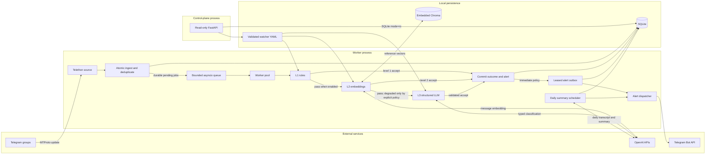

# Architecture

## Overview

Eidolon Telegram Scraper is a single-node, event-driven monitoring service. One worker
owns the Telethon `StringSession`, ingests updates through a bounded queue, and evaluates
each message against validated watcher policies. A separate FastAPI control plane reads
operational state but cannot mutate it or invoke Telegram or AI providers.

## Pipeline Contract

Stages are selected per watcher with `llm_level`; disabled stages are explicitly
`skipped`.

| Stage | Decision | Failure policy |
| --- | --- | --- |
| L1 rules | Minimum length, negative terms, then positive word or phrase matches | Deterministic rejection stops the pipeline; invalid policy files fail startup |
| L2 embeddings | Recall-oriented similarity to versioned positive and negative references | Provider or index failure is `degraded`; watcher default rejects, explicit `accept` can fail open |
| L3 LLM | Strict `relevant`, allowed intent, confidence, reason, and verbatim evidence | Timeout, provider, evidence, or parse failure is `degraded`; watcher default rejects |

SQLite records one idempotent outcome per message and watcher, including stage status,
model, latency, token usage, score or classification, acceptance, alert state, and a
bounded error code. This makes degraded provider behavior distinguishable from a
successful model decision.

## Trust Boundaries and Data Flow

- Telegram messages are untrusted data. L3 serializes them as user JSON and keeps the
  trusted watcher objective in the system prompt.
- Watcher YAML is trusted local policy, validated with frozen Pydantic models before the
  worker starts.
- OpenAI and Telegram are external processors. Their availability must not be confused
  with local pipeline health.
- SQLite contains message text, sender and chat metadata, decisions, and delivery state.
  Chroma contains configured reference embeddings.
- The control plane is unauthenticated by design and is safe only on loopback or behind
  an authenticated reverse proxy.

## Reliability and Delivery Semantics

Telegram ingress writes the message, chat metadata, and pending watcher jobs in one
transaction before placing a lightweight work item in the volatile queue. Each job stores
the complete watcher-policy fingerprint, so recovery cannot silently replay historical
text under changed rules or prompts. The queue
provides backpressure, worker count bounds concurrency, and duplicate updates are rejected
by a SQLite uniqueness constraint. Cancellation leaves a job pending; startup replays it
from stored message data. Unexpected poison jobs become terminal `failed` records instead
of blocking startup. Entity enrichment is best effort, transient SQLite ingress failures
retry with bounded backoff, and an update that still cannot be persisted stops the daemon
instead of pretending monitoring remains healthy. Shutdown disconnects ingress before
draining queued work.

An accepted outcome, its immutable alert payload, and funnel counters commit in one
transaction. The outbox worker leases each row immediately before delivery, attaches an
unguessable fencing token, records sanitized retry state, and moves it to terminal `sent`
or `failed`. A stale worker cannot commit after another owner reclaims an expired lease.
Successful delivery, pipeline provenance, and daily counters also commit together. Pending
rows survive restarts and retention sweeps. This provides at-least-once attempts, not
exactly-once delivery: a crash after Telegram accepts a request but before SQLite commits
`sent` can still produce a duplicate. Consumers must tolerate repeated alerts.

## Evaluation Contract

Offline and online evaluation reuse production stage components. Artifacts bind results
to dataset/config hashes, prompt version, models, intent and degradation policy, semantic
threshold and margin. They include the stopping stage, aggregate latency/usage, semantic
scores, and sanitized stage errors. Runtime rejects degraded required stages by default,
while online evaluation also fails its quality gate if any prediction degrades.
Calibration and blind corpora are separate; current metrics and known misses are
documented in [evaluation.md](evaluation.md).

## Design Decisions and Scale Limits

The three-stage flow uses small typed, constructor-injected components instead of
LangChain because orchestration is linear and the important behavior is explicit: cost
gates, failure policy, provenance, and provider lifecycle. The concrete OpenAI SDK
boundary remains deliberately narrow; extracting multi-provider ports is warranted only
when a second provider is implemented.

SQLite with WAL and embedded Chroma minimize operational overhead and fit one Telethon
session on one host. They do not provide multi-node high availability or shared vector
search, and SQLite still serializes writes. Sustained queue pressure, write contention,
large vector indexes, or a need for multiple replicas are migration signals for a
service database and remote vector store such as PostgreSQL and Qdrant.

Daily summary output is a strict Pydantic object. Telegram messages remain untrusted JSON,
and application code validates every returned source ID before rendering citation markers.
The scheduler reads a fixed `(previous 24 hours, scheduled time]` window, avoiding the
calendar-date gap of an evening digest. Catch-up after scheduler downtime and Bot API
delivery are still best effort rather than outbox-backed. Durable windowed digest chunks
are a deliberate next step, not an exactly-once claim.
