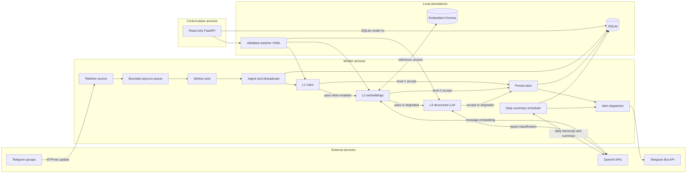

# Architecture

## Overview

Eidolon Telegram Scraper is a single-node, event-driven monitoring service. One worker
owns the Telethon `StringSession`, ingests updates through a bounded queue, and evaluates
each message against validated watcher policies. A separate FastAPI control plane reads
operational state but cannot mutate it or invoke Telegram or AI providers.

## Pipeline Contract

Stages are selected per watcher with `llm_level`; disabled stages are explicitly
`skipped`.

| Stage | Decision | Failure policy |
| --- | --- | --- |
| L1 rules | Minimum length, negative terms, then positive word or phrase matches | Deterministic rejection stops the pipeline; invalid policy files fail startup |
| L2 embeddings | Similarity to versioned positive and negative references | Provider or index failure is `degraded` and fails open |
| L3 LLM | Strict `relevant`, `intent`, `confidence`, `reason`, and `evidence` schema | Timeout, provider, or parse failure is `degraded` and fails open with zero confidence |

SQLite records one idempotent outcome per message and watcher, including stage status,
score or classification, alert state, and a bounded error code. This makes degraded
provider behavior distinguishable from a successful model decision.

## Trust Boundaries and Data Flow

- Telegram messages are untrusted data. L3 serializes them as user JSON and keeps the
  trusted watcher objective in the system prompt.
- Watcher YAML is trusted local policy, validated with frozen Pydantic models before the
  worker starts.
- OpenAI and Telegram are external processors. Their availability must not be confused
  with local pipeline health.
- SQLite contains message text, sender and chat metadata, decisions, and delivery state.
  Chroma contains configured reference embeddings.
- The control plane is unauthenticated by design and is safe only on loopback or behind
  an authenticated reverse proxy.

## Reliability and Delivery Semantics

The queue provides backpressure, worker count bounds concurrency, and duplicate Telegram
updates are rejected by a SQLite uniqueness constraint. Resources close in reverse
startup order, and shutdown attempts to drain queued messages before cancelling workers.

An accepted immediate alert is persisted before delivery. SQLite has idempotent alert
keys, leased claims, retry scheduling, and terminal `sent` or `failed` states. The current
worker sends inline, however, and does not run the leased replay loop; an unsuccessful
send remains `pending` and requires operator recovery. End-to-end at-least-once delivery
is therefore not currently guaranteed. If replay is enabled, a crash after Telegram
accepts a request but before SQLite commits `sent` can produce a duplicate, so downstream
consumers must tolerate repeated alerts.

## Design Decisions and Scale Limits

The three-stage flow uses small typed components instead of LangChain because orchestration
is linear and the important behavior is explicit: cost gates, failure policy, provenance,
and provider lifecycle. Provider adapters can change without introducing a general agent
runtime.

SQLite with WAL and embedded Chroma minimize operational overhead and fit one Telethon
session on one host. They do not provide multi-node high availability or shared vector
search, and SQLite still serializes writes. Sustained queue pressure, write contention,
large vector indexes, or a need for multiple replicas are migration signals for a
service database and remote vector store such as PostgreSQL and Qdrant.
